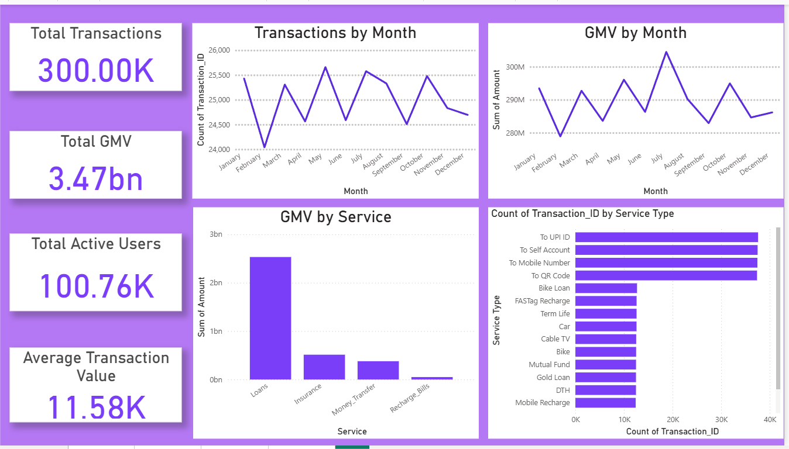
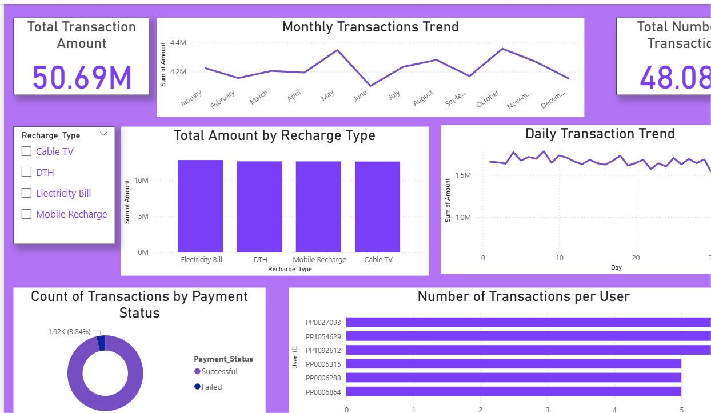
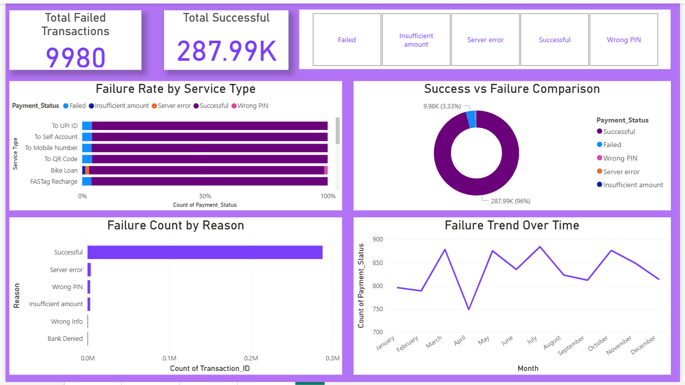
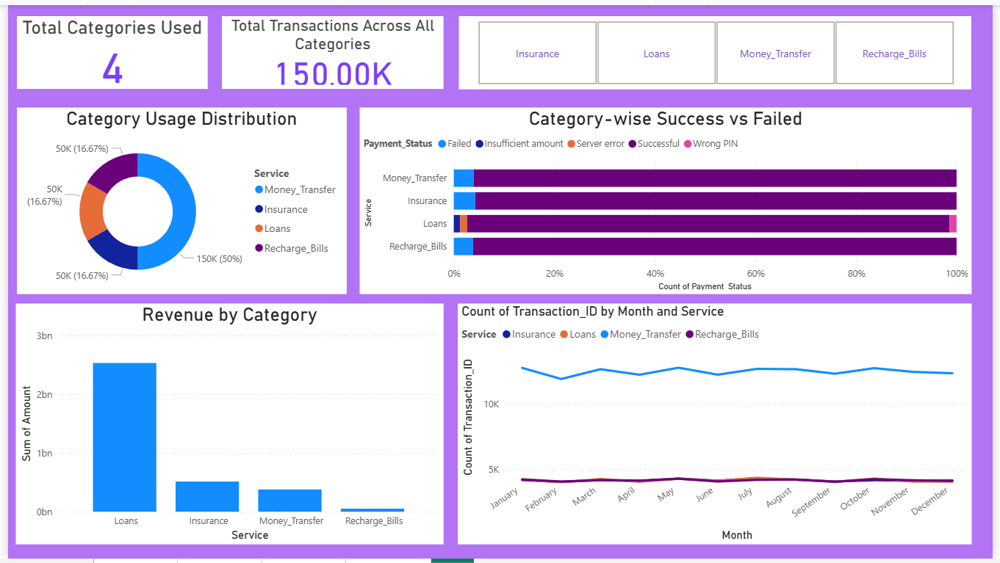

# Phonepe-Data-Analytics-Project
This is an exciting project I had prepared to push my limits in Power BI. 

[]&nbsp;

## Project Overview
This project is an end-to-end data analytics solution built using a PhonePe-style digital payments dataset. The goal is to understand user behavior, transaction patterns, revenue contribution, and service performance across core financial categories such as Recharge & Bills, Money Transfers, Loans, and Insurance. The dataset consists of six interconnected tables—Users, All Transactions, Recharge Bills, Money Transfer, Loans, and Insurance—capturing close to real-world FinTech workflows.

The project follows a structured analytics workflow: importing raw data, cleaning and transforming it, building a relational data model, and visualizing insights through fully interactive Power BI dashboards. A key challenge addressed in this project is completing all dashboard development, ensuring optimal performance while relying only on relationships, basic aggregations in visuals, and slicer-driven exploration.

Across five dashboards, the project highlights user demographics, transaction volumes, revenue trends, service-level performance, failure analytics, and cross-category behavior. Each dashboard includes KPIs, hierarchical drill-downs, filters, and visually consistent themes to support business decision-making. This project demonstrates strong competencies in BI design, data modeling, and storytelling—essential for Data Analyst roles in FinTech and payment platforms.

## Key Features of the Dashboard

Multi-Table Data Modeling:
Built using six interconnected datasets—Users, Transactions, Recharges, Money Transfers, Loans, and Insurance—connected through a clean star-schema model.

Four Fully Interactive Dashboards:
Covers User Overview, Transactions & Revenue, Service-Wise Insights, Failure Analytics, and High-Value User Segmentation.

Consistent Visual Design System:
Uses a unified color theme with blue (trust), purple (FinTech branding), and green (success metrics), ensuring a clean and professional look across all reports.

Dynamic Filtering & User-Level Exploration:
Includes slicers for service type, payment status, date range, and user demographics, enabling deep drill-down analysis.

Revenue & Volume Tracking:
KPI cards highlight total transactions, total revenue, average transaction value, success rate, and share of each service category.

Service-Specific Analytics:
Dedicated visuals for Recharges, UPI Transfers, Loans, and Insurance to identify which services drive the most revenue and engagement.

Failure & Delay Diagnostics:
Identifies the root causes of failed transactions by analyzing error patterns and payment status distribution.

User Behavior Insights:
Segments users by age, type of service usage, spending patterns, and frequency of transactions.

Business-Focused Storytelling:
Dashboards are designed to support strategic decisions like optimizing services, reducing failures, improving user retention, and identifying high-value customers.

## 📖 Storytelling From Insights

As we explored the PhonePe-style digital payments dataset, a clear story began to unfold. The platform’s primary strength lies in its high-volume, everyday services—Recharge & Bills and Money Transfers—where users interact most frequently. These services create strong engagement loops, driving consistent platform traffic.

However, when we shift focus to revenue, the narrative changes. While usage is dominated by UPI and Recharge services, the majority of revenue is generated from Loans and Insurance, revealing that low-frequency, high-value services contribute the most to financial performance. This highlights a classic fintech pattern: engagement comes from daily utility services, but profitability comes from financial products.

The dashboards also uncover hidden friction points. Failed transactions cluster around UPI payments, primarily due to “Payment Declined” or “Technical Error.” These failures, although not large in number, significantly impact user trust. Identifying these failure hotspots helps prioritize areas for system improvement.

User segmentation adds another layer to the story. Older users show a preference for Loan and Insurance services, while younger users engage more with Recharge and Money Transfer. This behavior pattern suggests distinct marketing and product strategies for different user groups.

Overall, the project narrates the evolution of a digital payments ecosystem where user habits, service performance, and revenue drivers interact to show how fintech platforms grow, retain users, and optimize profitability.

## Key Learnings
How to structure a business intelligence report for effective decision-making.
Techniques to highlight performance gaps and opportunities using data storytelling.
Strategies for integrating key influencers to enhance product pricing and customer engagement.

## Sample Dashboards

[]&nbsp;

[]&nbsp;

[]&nbsp;

[]&nbsp;
